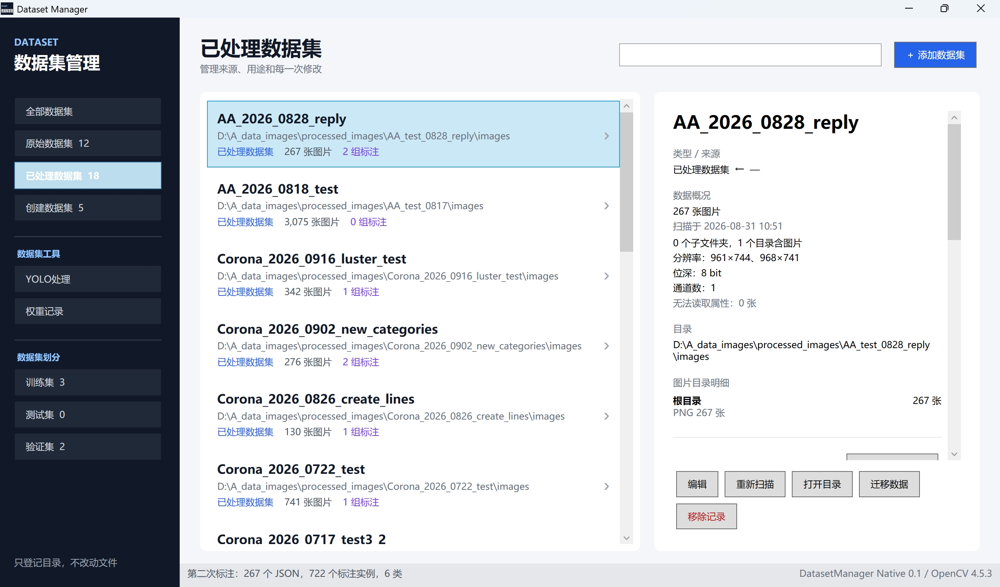

# Dataset Manager

一个用于登记、关联和追踪图像数据集的 Windows 桌面工具。当前初版负责管理数据集元数据，不负责格式转换。



## 当前功能

- 原始数据集、已处理数据集及数据集划分模块分组管理
- 全部、原始、已处理和创建数据集先按 `_YYYY_MMDD_` 前的项目名称排列，同一项目内再按日期倒序显示
- 训练集、测试集、验证集作为数据集划分大模块，提供“创建数据集”功能
- 默认只登记磁盘上的数据集目录；原始、已处理和已创建数据集可通过“迁移数据”复制或剪切到指定新路径，并同步更新主路径、标注路径和内部清单
- 派生数据集关联到一个原始数据集
- 数据集备注和修改记录
- 数据集扫描只读取图片，不在登记时读取标签
- 已处理数据集支持多组 LabelMe 标注批次，各自保存路径与规则备注
- 标注批次按 `shapes[].label` 自动统计缺陷类别和标注实例数
- 从多个“已处理数据集 + 标注批次”中选取指定数量或全部匹配对，生成带连续序号的 JSON 清单
- “创建数据集”模块读取清单并复制成独立的 `images`、`jsons` 数据集，可自定义子目录名
- 工具创建的数据集支持同时删除实际复制目录和管理记录
- YOLO处理：按指定类别将 LabelMe shape 转为 YOLO 目标检测框或语义分割 TXT，并生成类别表
- YOLO处理：转换后可检查本次生成的空标签，并选择保留或删除空 TXT
- YOLO处理：递归按 TXT 文件名检查两个标签目录的重复项，可定向删除一侧重复 TXT
- YOLO转换和重复检查均保存操作结果、路径、时间与备注
- 权重记录模块登记 PT、ONNX 等权重文件的名称、路径、自动识别格式、备注和修改历史
- 按子目录统计图片格式和数量，汇总分辨率、位深与通道数
- 本地 JSON 持久化
- C# 调用 C++/OpenCV DLL 的基础链路

## 构建

### 一键编译（推荐）

确认已经安装 Visual Studio 2022、CMake 和 .NET 8 SDK 后，直接双击项目根目录下的：

```text
build_release.bat
```

脚本会使用 Visual Studio 2022 x64 生成器，同时编译 C++/OpenCV DLL 和 C# WPF 程序。编译成功后程序位于：

```text
D:\Dataset_management\bin\Release\DatasetManager.App.exe
```

如果 OpenCV 目录以后发生变化，请修改 `build_release.bat` 开头的 `OPENCV_DIR`。

### 手动编译

```powershell
cmake -S . -B ./build -G "Visual Studio 17 2022" -A x64
cmake --build ./build --config Release
```

上面的 CMake 构建会同时编译 C++ DLL 和 WPF。仅在开发时直接运行 WPF，也可以使用：

```powershell
dotnet run --project src/DatasetManager.App/DatasetManager.App.csproj
```

Release 构建完成后，所有运行文件都集中在：

```text
D:\Dataset_management\bin\Release
```

直接双击或运行 `bin\Release\DatasetManager.App.exe` 即可。

### 发布可独立运行版本

如果目标电脑没有安装 .NET 8，请在开发电脑上双击：

```text
publish_standalone.bat
```

脚本会生成 Windows x64 自包含版本，将 .NET 8 运行环境、WPF 程序、C++ DLL、OpenCV DLL 和 Visual C++ x64 运行库集中到：

```text
D:\Dataset_management\bin\Standalone
```

把整个 `Standalone` 文件夹复制到其他 Windows x64 电脑，然后运行其中的 `DatasetManager.App.exe`。不能只复制 EXE，因为程序还需要同目录中的运行环境和 OpenCV 依赖文件。目标电脑不需要另外安装 .NET、OpenCV 或 Microsoft Visual C++ 运行库。

C++ 构建后会将自身 DLL，以及 `D:\opencv-4.5.3\opencv-4.5.3\build\install\bin` 下所需的 OpenCV DLL，复制到统一输出目录。

> C++ 构建需要 Visual Studio 2022 的“使用 C++ 的桌面开发”工作负载和 MSVC x64 编译器。如果尚未构建 C++ 组件，WPF 仍可启动，状态栏会显示 OpenCV 组件尚未构建。

## 记录保存位置

程序会在当前 EXE 所在目录旁创建 `records` 文件夹，管理记录与程序放在一起：

```text
records\catalog.json
records\yolo-operations.json
records\weights.json
records\logs\
```

- `catalog.json`：保存原始、已处理、训练、测试、验证和复制创建的数据集记录，包括路径、备注、修改历史、标注批次及统计信息。
- `yolo-operations.json`：保存 YOLO 格式转换和重复数据检查的操作路径、结果及备注。
- `weights.json`：保存权重名称、文件路径、格式、备注及修改记录；移除记录不会删除实际权重文件。
- 训练集、测试集和验证集的图片/标签配对清单保存在创建时选择的 JSON 路径中；该路径也会记录到 `catalog.json`。
- 复制创建的数据集目录内会额外保存 `dataset.json` 清单和隐藏的 `.dataset-manager-owned.json` 所有权标记。
- 程序崩溃日志保存在 `records\logs`。

第一次运行新版时，如果 `%LOCALAPPDATA%\DatasetManager` 中存在旧版记录，程序会自动复制到当前 EXE 旁的 `records`；旧记录仍会保留作为备份。之后只读写当前 `records`。普通版位置为 `bin\Release\records`，独立版位置为 `bin\Standalone\records`。

`publish_standalone.bat` 重新发布时会保留 `bin\Standalone\records`。手工删除整个程序目录也会删除其中的记录，因此建议备份时复制整个程序文件夹，或至少单独备份 `records`。
